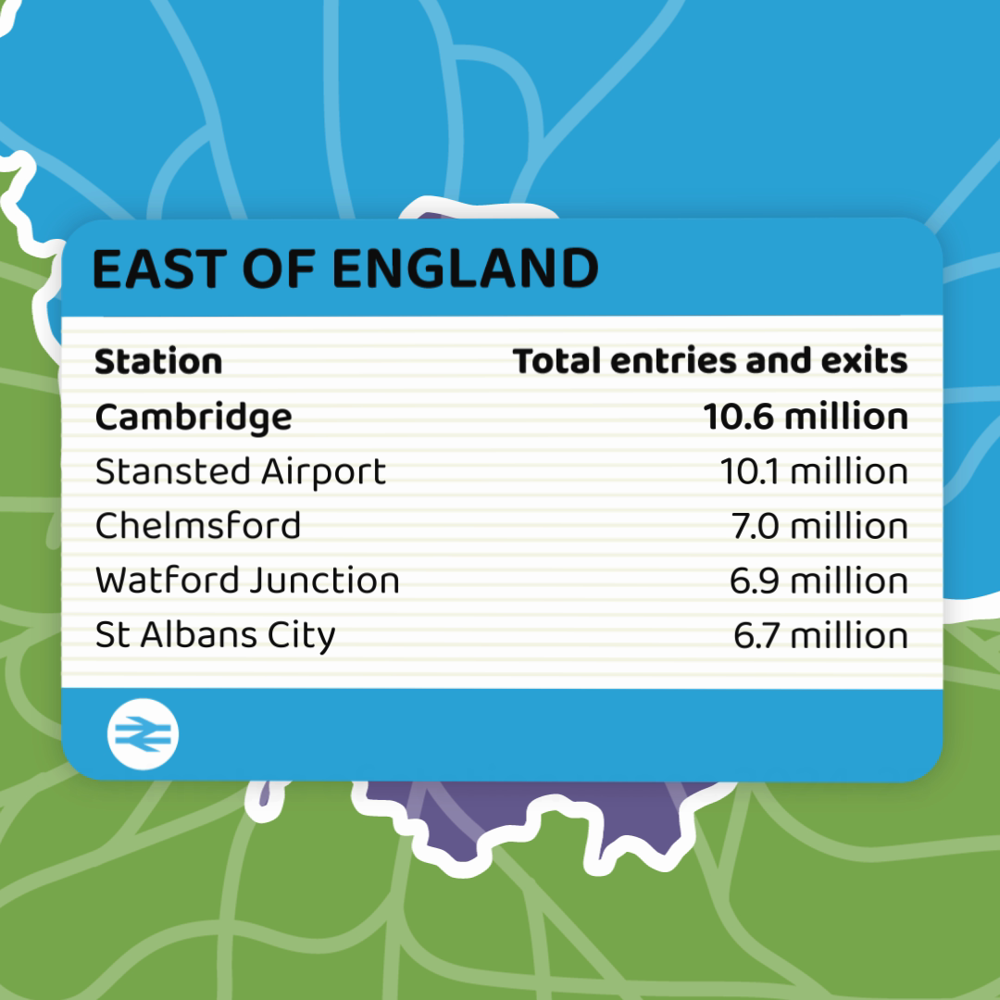
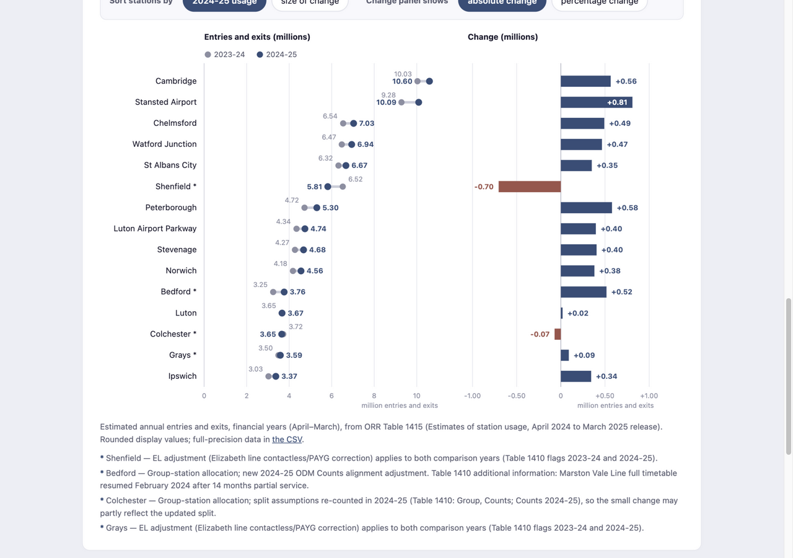

# Visualization Critique and Redesign Report

**Word count:** 688 words (whitespace-delimited tokens containing a letter or digit; headings, figure captions, and references excluded; link labels included).

---

## Original visualization and context

The Office of Rail and Road (ORR) publishes annual *Estimates of station usage* — model-based estimates of entries and exits at every Great Britain station, derived from ticket sales for financial years (April–March). Alongside the April 2024 to March 2025 release, ORR published an animated "departure board" showing the five most used stations in each of eleven regions, one board at a time, over a colour-coded map ([animation](https://dataportal.orr.gov.uk/media/brplcsfr/most-used-top-5-stations-in-each-region-train-board.mp4); [release](https://dataportal.orr.gov.uk/media/msigcn24/station-usage-2024-25-statistical-release.pdf)). Its intended audience is the general public and media; its message is which stations lead each region; and its release narrative adds that the top five were unchanged in eight of eleven regions. The reading tasks it invites: name a region's leading stations, grasp their approximate size, and sense regional leaders at a glance.

## Critique

**Strengths.** (1) The rail-departure-board metaphor is faithful and legible: full station names, a clear rank-1 emphasis, and consistent units make every board self-explanatory at social-media size. (2) The headline numbers are honest and consistent — the same 2024–25 figures appear on the boards, in the release's bar charts, and in ORR's dashboard.

**Weaknesses.** (1) *Only one year is shown*, although change is the release's own headline: readers learn that eight of eleven top-five lists stayed the same, but nothing shows whether usage at those stations grew or shrank, or by how much. (2) *No visual channel encodes the values*: numbers appear only as typed text, so comparing sizes relies on reading and remembering digits, although position on a common scale is the most accurately decoded channel for magnitude. (3) *The sequential animation destroys comparison*: each board lives for roughly ten seconds and then vanishes; comparing regions means memorizing numbers, and at the end of the video no data remains on screen. A further, subtler problem is the *top-five cutoff*: a station can change dramatically yet disappear from the board (or stay on it while declining), so "unchanged top five" can mask real movement.

## Redesign rationale

The redesign zooms into one region the original compresses into seconds — East of England — and shows the fifteen busiest stations (a set frozen by 2024–25 usage), comparing 2023–24 with 2024–25 from the same Table 1415 release.

**Decision 1 — a dumbbell chart for the two years.** Each station becomes one row with a grey dot (2023–24) and a blue dot (2024–25) on a zero-based scale. The gap between the dots *is* the change, so direction and magnitude are readable in the same glance that reads the levels. This directly addresses the missing year and the missing magnitude channel; the trade-off is a less familiar form, softened by a legend and direct labels.

**Decision 2 — an aligned diverging change panel with an absolute⇄percentage toggle.** The change gets its own zero-referenced bars sharing the row order, in millions or per cent. The two views genuinely diverge: Stansted Airport leads in absolute terms (+0.81m) but ranks seventh by growth rate (eighth by absolute percentage-change magnitude), while Bedford (+15.9%) leads relatively — a distinction the original could never draw. Signs and colour encode direction redundantly, so nothing depends on hue alone.

**Decision 3 — a frozen selection with sorting instead of filtering.** Fifteen stations stay fixed across every view; controls only re-sort. Boundary events therefore stay visible — Shenfield's fall from the regional top five (−10.8%) happens on the page instead of being replaced by a silent roster change. The cost is selection bias toward currently busy stations, stated on the page.

**Decision 4 — estimate status and caveats on the page.** Subtitles state that figures are estimated annual entries and exits in millions; stations with documented comparability caveats (for example Bedford's new 2024–25 ODM Counts alignment adjustment) carry footnotes rather than hover-only information.

## Original vs redesign, trade-offs, and limitations

The redesign makes the original's blind spot — change — the centrepiece: Shenfield's decline is visible as a reversal rather than a roster swap, and level comparisons happen along common scales without animation-imposed memory burden. It is deliberately narrower: one region, fifteen busy stations, no map, and none of the video's entertainment value; results describe this selection, not the region or country's fastest-growing stations. Methodological uncertainty remains: ORR's estimates are model-based, and documented 2024–25 methodology changes and station-specific adjustments mean year-to-year differences are changes in *estimated* usage, not measured passenger counts.

## Figures

Figure 1. East of England board from ORR’s 2024–25 regional animation. Source: ORR, Crown copyright, OGL v3.0.

Figure 2. Redesign showing two annual usage estimates and their absolute changes for the fixed fifteen-station selection.

## References

1. Office of Rail and Road (4 December 2025). *Estimates of station usage, April 2024 to March 2025*. Statistical release and Figure 2.4.
2. ORR. Table 1415: Time series of passenger entries and exits by station (both comparison years); Table 1410 (metadata, adjustment flags).
3. ORR. *Top 5 most used stations in each Region in Great Britain* (MP4 animation).
4. ORR. *Estimates of station usage: quality and methodology report*; *FAQs*.
5. Contains ORR material © Crown copyright and database right 2025, Open Government Licence v3.0.
